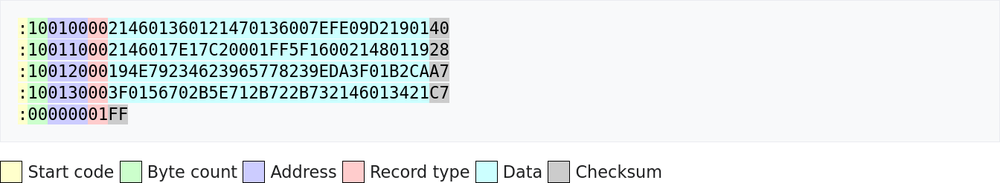

---
title: "Ćwiczenie 10: Zawody CTF (_Capture&nbsp;the flag_)"
subtitle: "Instrukcja laboratorium"
footer-left: "Instrukcja laboratorium"
author: [Mariusz Chilmon <<mariusz.chilmon@ctm.gdynia.pl>>]
lang: "pl"
titlepage: yes
titlepage-logo: "logo.png"
logo-width: "70mm"
colorlinks: yes
header-includes: |
  \usepackage{awesomebox}
  \usepackage{algorithm}
  \usepackage{algpseudocode}
...

> Give a man a program, frustrate him for a day. Teach a man to program, frustrate him for a lifetime.
>
> — _Muhammad Waseem_

# Cel ćwiczenia

Celem ćwiczenia jest zapoznanie się z:

* strukturą pliku Intel HEX,
* budową instrukcji w procesorze.

# Wprowadzenie

Otrzymałeś produkcyjną wersję urządzenia X[^1]. Wiesz, że wersja serwisowa wyświetla sekretny kod (flagę) po wciśnięciu przycisku podłączonego do pinu `PC4`. Przycisk ten nie jest jednak montowany w&nbsp;wersji produkcyjnej. Zmień wsad urządzenia tak, by flaga była wyświetlana po wciśnięciu przycisku _S1_, który jest podłączony do pinu `PC1`.

[^1]: Być może opracował je Elon Musk. To tłumaczyłoby nazwę.

\awesomebox[gray]{2pt}{\faMonument}{gray}{Zawody CTF organizowane są od 1996 roku w ramach konferencji cyberbezpieczeństwa, a także jako samodzielne imprezy, wspierane nawet przez organizacje rządowe. Na ogół polegają na łamaniu zabezpieczeń stron internetowych i serwerów, ale pojawiają się również konkursy dotyczące systemów wbudowanych.}

# Uruchomienie programu wyjściowego

1. Podłącz płytkę _WPSH209_ do _Arduino Uno_.
1. Wyświetlacz wskazuje wartość `8888`.

# Zadanie podstawowe

Odczytywanie stanu przycisku odbywa się za pomocą rozkazu `SBIS` (_Skip if Bit in I/O Register is Set_), który jest najprostszym rozkazem pozwalającym zrealizować warunek zależny od pojedynczego bitu w rejestrze I/O[^2]. Celem zadania podstawowego jest określenie pełnego opcode'u tej instrukcji i&nbsp;odnalezienie go w pliku `bin/laboratory.hex`.

[^2]: Wprawdzie równie dobrze mógłby być użyty rozkaz `SBIC` (_Skip if Bit in I/O Register is Cleared_), ale dla uproszczenia zadania pomijamy badanie tej możliwości.

Poniżej zaprezentowana jest struktura pliku Intel HEX. Kolor jasnoniebieski oznacza dane, które są przedmiotem naszego zainteresowania.

# Zadanie rozszerzone

Celem zadania rozszerzonego jest wgranie do urządzenia własnej wersji oprogramowania, reagującej na przycisk _S1_.

## Wymagania funkcjonalne

1. Po wciśnięciu przycisku _S1_ wyświetlana jest flaga.

## Modyfikacja programu

Zmodyfikuj plik `bin/laboratory.hex` i wgraj go do urządzenia. Każda linia pliku w standardzie Intel HEX zakończona jest sumą kontrolną. Suma kontrolna służy do wykrywania zmian w zawartości pliku, więc po podmianie instrukcji z bardzo dużym prawdopodobieństwem stanie się nieprawidłowa. Programator _AVRDUDE_ wykryje to i wydrukuje spodziewaną wartość, którą należy wpisać w pliku.
